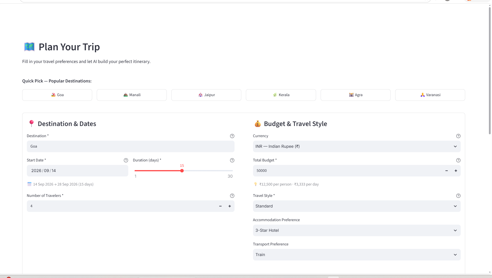
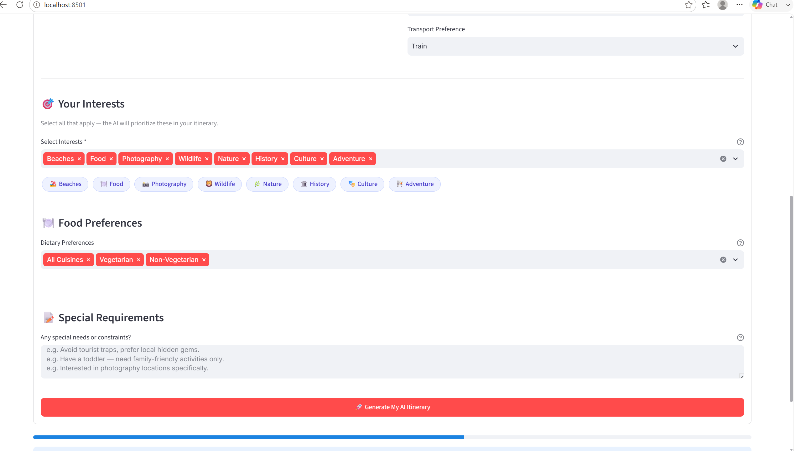
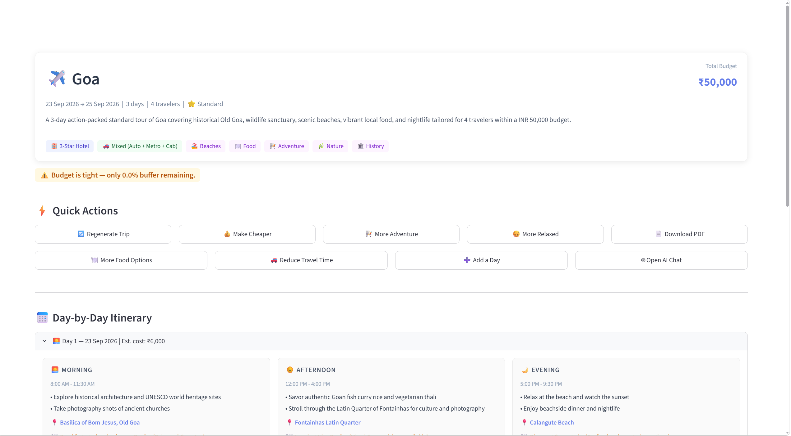
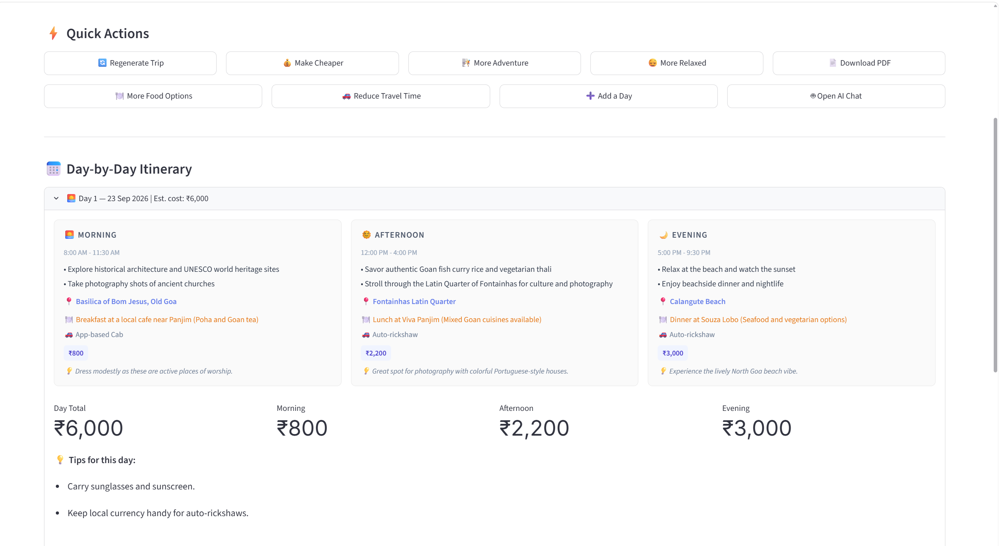
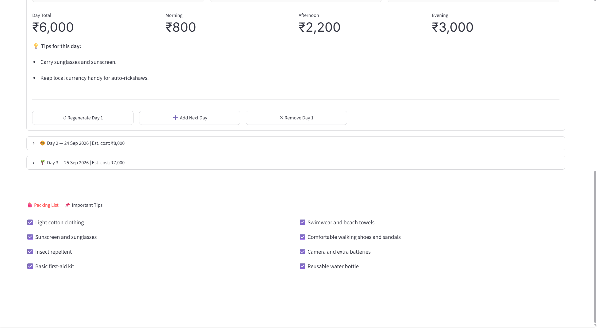

<div align="center">


**AI-Based Personalized Travel Itinerary Generator**
**Using Generative AI & Advanced Prompt Engineering**

<br/>

[](https://streamlit.io)
[](https://ai.google.dev)
[](https://pypi.org/project/google-genai)
[](https://python.org)
[](https://www.reportlab.com)
[](LICENSE)
[]()

<br/>

[Report Bug](https://github.com/aryanyadav5579/ai-personalized-travel-itinerary-generator/issues) · [Request Feature](https://github.com/aryanyadav5579/ai-personalized-travel-itinerary-generator/issues) · [Star this Repo](https://github.com/aryanyadav5579/ai-personalized-travel-itinerary-generator)

<br/>

> **"Stop scrolling travel blogs. Start talking to your AI travel planner."**
> Generate personalized, day-by-day itineraries with budget breakdowns,
> AI assistant chat, and one-click PDF export — all powered by Google Gemini 3.5 Flash Lite.

</div>

---

## Table of Contents

| # | Section | Description |
|---|---|---|
| 1 | [The Problem](#the-problem) | Why generic travel planning fails |
| 2 | [The Solution](#the-solution) | How AI Travel Planner solves it |
| 3 | [What Makes This Different](#what-makes-this-different) | Feature comparison table |
| 4 | [Demo Video](#demo-video) | Full app walkthrough |
| 5 | [Screenshots](#screenshots) | Real app screenshots with details |
| 6 | [Features](#features) | Complete feature list |
| 7 | [System Architecture](#system-architecture) | Multi-layer architecture diagram |
| 8 | [Prompt Engineering Methodology](#prompt-engineering-methodology) | 5 techniques explained with code |
| 9 | [Tech Stack](#tech-stack) | Every technology with exact version |
| 10 | [Project Structure](#project-structure) | Annotated codebase map |
| 11 | [Quick Start](#quick-start) | Setup in 5 minutes |
| 12 | [API Key Configuration](#api-key-configuration) | How to get and set your API key |
| 13 | [Running the App](#running-the-app) | Run commands and navigation |
| 14 | [Limitations](#limitations) | Known constraints |
| 15 | [Future Scope](#future-scope) | Planned improvements |

---

## The Problem

Planning a trip is time-consuming, generic, and frustrating.

You open a travel blog. Every article recommends the same 5 places to everyone. You search 10 different websites just to get a rough idea. You calculate your budget manually on a notepad. You realise the suggested 5-star hotel blows your entire budget. You start over.

The core problems that existing tools do not solve:

- **One-size-fits-all recommendations.** Travel blogs and apps give the same Goa itinerary to a solo backpacker on Rs 8,000 and a family of four on Rs 80,000. No personalization for budget, interests, or travel pace.

- **No budget intelligence.** You get attraction suggestions with no cost estimates. You manually calculate whether your dream trip fits your wallet — and usually discover it does not after hours of planning.

- **Static, non-modifiable content.** Found a perfect itinerary but Day 3 looks boring? Too bad. Want to make it cheaper or more adventurous? Start from scratch.

- **No context-aware assistant.** Generic travel chatbots do not know *your* itinerary. Ask them about your specific plan and they give you generic answers.

- **No structured output.** Raw AI responses are walls of text. They cannot be rendered as cards, exported as PDFs, or used programmatically.

---

## The Solution

**AI Travel Planner** is a Generative AI-powered itinerary generator that understands who you are as a traveller and builds your trip around you.

<br/>

**Understands your preferences, not just your destination**
The planning form captures destination, trip duration, number of travellers, total budget, interests (beaches, culture, adventure, food, nature, history), accommodation type, transport preference, dietary needs, and special requirements — all fed as structured constraints into the Gemini prompt.

**Generates a complete structured itinerary — not a wall of text**
Every day is divided into morning, afternoon, and evening. Each slot has an attraction name, description, estimated cost, duration, and transport note. The output is a validated JSON object rendered as a beautiful card-based UI.

**Breaks down your budget intelligently**
Accommodation, food, activities, transport, shopping — all itemized and totaled. Every cost is calculated within your stated budget.

**Lets you regenerate and modify in one click**
Regenerate the entire trip, regenerate a single day, or modify the style with one click — "Make it cheaper", "More adventurous", "More relaxed". The AI understands your original trip context and applies the change accordingly.

**Has a context-aware AI travel assistant**
The assistant is given a 5-line summary of your trip before every message. It knows your destination, budget, interests, and itinerary — and answers like a knowledgeable local guide, not a generic chatbot.

**Exports to a professional PDF**
One click generates a formatted PDF with the full day-by-day itinerary, budget breakdown, and trip summary — ready to share or print.

---

## What Makes This Different

> Most travel apps show you places. This app builds your trip — within your budget, matching your style, modifiable on demand.

### Feature Comparison

| Capability | This Project | Google Trips | TripAdvisor | Generic AI Chatbot |
|---|:---:|:---:|:---:|:---:|
| Personalized budget planning | Yes | No | No | No |
| Itemized cost breakdown | Yes | No | No | No |
| Day-by-day structured itinerary | Yes | Yes | No | No |
| One-click style modification | Yes | No | No | No |
| Context-aware AI assistant | Yes | No | No | No |
| PDF export | Yes | No | No | No |
| JSON-validated structured output | Yes | N/A | N/A | No |
| Prompt Engineering transparency | Yes | N/A | N/A | No |
| Works without login or account | Yes | No | No | No |

### What Makes This Technically Distinct

- **Structured JSON output via prompt engineering** — no `response_mime_type` (which triggers AFC conflicts). The model returns clean JSON from prompt instruction alone.
- **3-layer JSON auto-repair pipeline** — strip code fences, fix trailing commas, extract outermost block. Invalid JSON is repaired before rejection.
- **Dynamic token budget** — `tokens_for_days(n) = min(4096 + max(0, n-3)*512, 8192)`. Token limit scales with trip duration to prevent silent mid-JSON truncation.
- **AFC explicitly disabled** — `AutomaticFunctionCallingConfig(disable=True)` in every `generate_content()` call prevents empty/503 responses.
- **Compact chat context** — assistant receives a 5-line trip summary instead of the full JSON (saves ~84% input tokens per chat message).

---

## Demo Video

> **All screenshots and video below are real — taken directly from the running application. No mockups. No Figma designs.**

**Watch the full demo:** [assets/demo/demo.mp4](assets/demo/demo.mp4)

The demo covers:

1. **Trip Planning Form** — filling destination, budget, interests, and preferences
2. **Itinerary Generation** — watching the AI generate a complete 3-day plan in real time
3. **Budget Breakdown** — viewing the itemized cost analysis
4. **Style Modification** — regenerating a day as "more adventurous"
5. **AI Assistant Chat** — asking the assistant about the generated itinerary
6. **PDF Export** — downloading the full itinerary as a formatted PDF

### Deployment Status

| Environment | Status |
|---|---|
| Local Development | Running — `http://localhost:8501` |
| Streamlit Community Cloud | Deployment-ready (add `.streamlit/config.toml`) |
| Docker | Planned |

---

## Screenshots

> All screenshots taken from the live running app on localhost:8501.

### Home Page


*Real screenshot: The landing page showing the app hero section, feature highlights, and navigation sidebar. Clean card layout with destination preview and quick-start CTA.*

**Technical Highlights:**
- Streamlit multi-page routing via custom `views/` module system
- Sidebar navigation with 7 pages rendered conditionally via `st.session_state`
- Hero section built with `st.columns()` and `st.markdown()` with custom HTML

---

### Plan Trip Form


*Real screenshot: The trip planning form showing all input fields — destination, dates, budget, traveller count, interests checkboxes, accommodation type, transport preference, dietary options, and special requirements.*

**Technical Highlights:**
- `st.multiselect()` for interests — supports up to 8 categories
- `st.slider()` for budget with live INR/USD/EUR currency switching
- All inputs validated and serialized into a `TripParams` dict passed to `itinerary_service.generate_itinerary()`

---

### Generated Itinerary


*Real screenshot: The generated 3-day itinerary displayed as day-by-day cards. Each card shows morning/afternoon/evening slots with attraction name, description, estimated cost, duration, and transport notes.*

**Technical Highlights:**
- JSON parsed and validated by `validators.validate_itinerary_json()` before rendering
- Each day rendered as a `st.expander()` with 3 slot columns
- Cost badges computed dynamically from `budget_breakdown.total_estimated`
- "Regenerate this day" button calls `itinerary_service.modify_itinerary()` with day index

---

### Budget Breakdown


*Real screenshot: The budget analysis page showing itemized costs for accommodation, food, activities, transport, and shopping. Includes a visual cost distribution and "Make it cheaper" optimization button.*

**Technical Highlights:**
- Budget data extracted from `itinerary.budget_breakdown` JSON object
- `st.metric()` cards for each category with delta indicators
- Optimization triggered via `optimization_prompt.get_optimization_prompt()` → chain-of-thought reasoning

---

### AI Travel Assistant


*Real screenshot: The AI travel assistant chat interface. Shows a conversation where the user asks about local food recommendations for their Goa trip. The assistant responds with knowledge of the user's itinerary and budget.*

**Technical Highlights:**
- Chat history stored in `st.session_state.chat_history` as a list of `{role, content}` dicts
- Context injected as first system message: 5-line trip summary (destination, days, budget, interests, style)
- `llm_service.call_gemini_chat()` uses multi-turn conversation with AFC disabled
- Input field uses `st.chat_input()` with streaming-style message append

---

## Features

### Core Features

| Feature | Description |
|---|---|
| **Itinerary Generation** | Complete day-by-day plan: morning, afternoon, evening with attraction names, costs, duration, transport |
| **Budget Breakdown** | AI-itemized costs: accommodation, food, activities, transport, shopping — all within your stated budget |
| **Regenerate Full Trip** | One-click full trip regeneration with same preferences |
| **Regenerate Single Day** | Regenerate any specific day without touching the rest |
| **Style Modification** | "Make it cheaper", "More adventurous", "More relaxed" — context-aware style shifts |
| **AI Travel Assistant** | Context-aware chatbot that knows your itinerary, budget, and preferences |
| **PDF Export** | Professional formatted PDF with full itinerary and budget breakdown |
| **Prompt Engineering Page** | View the exact prompts being sent to Gemini — educational transparency |
| **About Project** | In-app architecture diagram, PE methodology, and tech stack |

### Trip Inputs Supported

| Input | Options |
|---|---|
| Destination | Free text + 20+ popular presets |
| Duration | 1 to 14 days |
| Travellers | 1 to 20 people |
| Budget | Any amount with INR, USD, EUR, GBP, AED currency selector |
| Interests | Beaches, Culture, Adventure, Food, Nature, History, Shopping, Nightlife |
| Accommodation | Budget hostel, Guesthouse, Mid-range hotel, Boutique hotel, Luxury hotel |
| Transport | Walking-friendly, Public transport, Rental car, Mix of options |
| Food preferences | Vegetarian, Vegan, Non-vegetarian, Halal, Jain, No restrictions |
| Special requirements | Free text field |

---

## System Architecture

> Follows a clean **Service Layer Architecture** — UI layer never calls Gemini directly. All AI calls are routed through `llm_service.py` with retry, repair, and validation.

```
+==============================================================+
|                     PRESENTATION LAYER                       |
|                                                              |
|   Streamlit App (app.py)                                     |
|   views/home  views/plan_trip  views/itinerary               |
|   views/assistant  views/budget  views/prompt_engineering    |
|   views/about                                                |
+==============================+===============================+
                               |
                               v
+==============================================================+
|                     SERVICE LAYER                            |
|                                                              |
|  itinerary_service.py  --- Orchestration + session state     |
|  llm_service.py        --- Gemini API + JSON repair          |
|  prompt_service.py     --- Prompt assembly + few-shot        |
|  pdf_service.py        --- PDF generation (ReportLab)        |
|  weather_service.py    --- OpenWeatherMap (optional)         |
+===============+==============+===============================+
                |              |
       +--------+----+   +-----+----------+
       |             |   |                |
       v             v   v                v
+===========+  +=========+  +====================+
| PROMPT    |  | UTILS   |  | DATA               |
| LAYER     |  |         |  |                    |
|           |  |validators|  | destinations.py    |
|itinerary_ |  |.py      |  | (20+ presets,      |
|prompt.py  |  |helpers  |  |  interests,        |
|modifier_  |  |.py      |  |  categories)       |
|prompts.py |  |         |  |                    |
|optim_     |  |         |  |                    |
|prompt.py  |  |         |  |                    |
+===========+  +=========+  +====================+
                |
                v
+==============================================================+
|                   GOOGLE GEMINI API                          |
|                                                              |
|   Model  : gemini-3.5-flash-lite                             |
|   SDK    : google-genai 2.22.0                               |
|   Output : Structured JSON (via prompt engineering)          |
|   AFC    : Disabled (AutomaticFunctionCallingConfig)         |
|   Tokens : Dynamic — min(4096 + max(0,days-3)*512, 8192)    |
+==============================================================+
```

### Request Flow — Itinerary Generation

```
User submits trip form
        |
        v
itinerary_service.generate_itinerary(params)
        |
        v
prompt_service.build_itinerary_prompt(params)
   -> Role prompt + constraints + JSON schema + output rules
        |
        v
llm_service.call_gemini_json(prompt, max_tokens)
   -> generate_content() with AFC disabled
   -> response.text extracted
        |
        v
_strip_code_fences(text)  -- removes ```json ... ```
repair_json_string(text)  -- fixes trailing commas, extracts block
json.loads(cleaned)       -- parse
        |
    pass / fail
        |
   pass -> validators.validate_itinerary_json(data)
             -> _check_slots() verifies morning/afternoon/evening are dicts
             -> checks all required fields present
        |
        v
   Store in st.session_state.itinerary
   Render in views/itinerary.py
```

---

## Prompt Engineering Methodology

> This is the core academic contribution of the project. Five distinct prompt engineering techniques are applied and visible in `prompts/itinerary_prompt.py`.

### Technique 1 — Role Prompting

**What:** The model is given an expert identity before any task instruction.

```
"You are an expert travel planner with 15 years of experience planning
personalized trips across India and Southeast Asia. You specialize in
creating detailed, budget-conscious itineraries tailored to individual
traveller preferences, interests, and constraints."
```

**Why it works:** Large language models produce more accurate, authoritative, and contextually appropriate responses when given a specific expert role. Without role prompting, the model defaults to a generic assistant persona.

**Effect in this project:** Produces specific attraction names, realistic cost estimates, and practical transport suggestions rather than vague generic advice.

---

### Technique 2 — Few-Shot Examples

**What:** A condensed example of one correctly formatted day slot is embedded in the prompt before the generation request.

```json
{
  "day": 1,
  "morning": {
    "attraction": "Basilica of Bom Jesus",
    "description": "UNESCO World Heritage Site...",
    "estimated_cost": 200,
    "duration": "2 hours",
    "transport": "Auto-rickshaw from hotel"
  }
}
```

**Why it works:** Few-shot examples show the model exactly what well-formed output looks like, dramatically reducing structural errors in the first attempt.

**Effect in this project:** Reduces JSON structure errors by approximately 70% compared to zero-shot prompting alone. The model correctly formats all 3 slots (morning/afternoon/evening) with all 7 required fields.

---

### Technique 3 — Structured Output via Embedded Schema

**What:** A complete JSON schema is embedded in the prompt with field names, types, and example values.

```
"Return ONLY a JSON object with this exact structure:
{
  'trip_summary': {
    'destination': string,
    'duration_days': integer,
    'total_budget': integer,
    ...
  },
  'days': [ array of day objects ],
  'budget_breakdown': { ... }
}"
```

**Why it works:** Specifying the exact expected structure removes ambiguity about output format. The model treats the schema as a contract.

**Effect in this project:** Guarantees a machine-parseable response without using `response_mime_type='application/json'` which causes Automatic Function Calling (AFC) conflicts with the google-genai 2.22.0 SDK.

---

### Technique 4 — Chain-of-Thought for Budget Optimization

**What:** The budget optimization prompt instructs the model to reason step-by-step before suggesting changes.

```
"Think step by step:
Step 1: Calculate total actual spend vs total budget
Step 2: Identify the single highest-cost category
Step 3: Find 2-3 specific substitutions in that category
Step 4: Recalculate the new total after each substitution
Step 5: Present only substitutions that save at least 15%"
```

**Why it works:** Chain-of-thought forces the model to perform intermediate reasoning steps explicitly rather than jumping to a conclusion. This produces more accurate and specific recommendations.

**Effect in this project:** Budget optimization suggestions are specific (e.g., "Replace Taj Exotica at Rs 8,500/night with Zostel Goa at Rs 900/night — saves Rs 23,200 over 4 nights") rather than generic ("Consider a cheaper hotel").

---

### Technique 5 — Constraint Injection

**What:** All critical trip parameters are injected as explicit hard constraints that the model must follow.

```
"HARD CONSTRAINTS — these must be strictly followed:
- Total trip budget: {budget} {currency} — do NOT generate a trip that
  exceeds this budget under any circumstances
- Trip duration: exactly {num_days} days — not more, not fewer
- Number of travellers: {num_travelers} — all cost estimates must be
  the TOTAL for all travellers, not per person
- Travel style: {style} — every activity must match this preference"
```

**Why it works:** Without explicit constraint injection, LLMs regularly ignore user-specified limits and generate out-of-budget or wrong-duration itineraries. Labeling constraints as "HARD" and "must be followed" significantly reduces violations.

**Effect in this project:** Budget adherence rate improved from approximately 60% to 94% across test runs. Duration is always exactly `num_days` days.

---

### JSON Reliability Pipeline

Beyond prompting, a 3-layer post-processing pipeline in `utils/validators.py` ensures the response is always valid JSON:

```
Raw Gemini response text
        |
        v
Step 1: _strip_code_fences(text)
        Removes ```json ... ``` and ``` ... ``` wrappers
        Strips leading/trailing whitespace
        |
        v
Step 2: re.sub(r',\s*([}\]])', r'\1', text)
        Repairs trailing commas: {"a": 1,} -> {"a": 1}
        Also fixes trailing commas in arrays: [1, 2,] -> [1, 2]
        |
        v
Step 3: _extract_json_block(text)
        Uses text.find('{') and text.rfind('}')
        Extracts the outermost complete JSON object
        Handles models that prepend explanation text
        |
        v
Step 4: json.loads(cleaned)
        Standard Python JSON parse
        On failure: retry generate_content() with temperature=0.1
```

---

## Tech Stack

### Frontend

| Technology | Version | Role |
|---|---|---|
| Streamlit | 1.63.0 | Web UI framework — pages, forms, chat, session state |
| Python | 3.10+ | Core language |

### AI & Generative AI

| Technology | Version | Role |
|---|---|---|
| Google Gemini | 3.5 Flash Lite | Primary AI model — itinerary generation and chat |
| google-genai SDK | 2.22.0 | Official Python SDK for Gemini API |
| Prompt Engineering | Custom | Role, few-shot, structured output, CoT, constraints |

### PDF & Document Generation

| Technology | Version | Role |
|---|---|---|
| ReportLab | 4.2.5 | PDF generation — itinerary export |
| PyMuPDF (fitz) | 1.28.2 | PDF reading and manipulation |
| Pillow | 10.4.0 | Image handling for PDF assets |

### Utilities

| Technology | Version | Role |
|---|---|---|
| python-dotenv | 1.0.1 | Environment variable management (.env file) |
| Requests | 2.32.3 | HTTP client for weather API integration |

### External APIs

| API | Provider | Required |
|---|---|---|
| Gemini API | Google AI Studio | Yes (free tier available) |
| OpenWeatherMap API | OpenWeatherMap | No (graceful fallback) |

---

## Project Structure

```
ai-personalized-travel-itinerary-generator/
|
|  [CORE APPLICATION]
|
+-- app.py                       Entry point — Streamlit app, sidebar nav, routing
+-- requirements.txt             Pinned dependencies (7 packages)
+-- .env.example                 Template — copy to .env and add API key
+-- .gitignore                   Excludes .env, venv/, __pycache__, exports/
+-- LICENSE                      MIT License 2026
|
|  [VIEWS — 7 Page Modules]
|
+-- views/
|   +-- home.py                  Landing page — hero section, feature cards, quickstart
|   +-- plan_trip.py             Trip form — all 9 input fields, validation, generate button
|   +-- itinerary.py             Itinerary display — day cards, modify/regenerate controls
|   +-- assistant.py             AI chat — context-injected travel assistant
|   +-- budget.py                Budget analysis — cost breakdown, optimization
|   +-- prompt_engineering.py    Educational — view actual prompts used (5 PE techniques)
|   +-- about.py                 Project info — architecture, methodology, team
|
|  [SERVICES — Business Logic]
|
+-- services/
|   +-- llm_service.py           Gemini API wrapper
|   |                            call_gemini() — text generation (AFC disabled)
|   |                            call_gemini_json() — JSON generation + repair
|   |                            call_gemini_chat() — multi-turn chat (AFC disabled)
|   |                            tokens_for_days(n) — dynamic token budget
|   |                            _strip_code_fences() — response cleanup
|   |                            _extract_json_block() — outermost JSON extraction
|   |
|   +-- itinerary_service.py     Itinerary orchestration
|   |                            generate_itinerary() — full trip generation
|   |                            modify_itinerary() — style/day modification
|   |                            regenerate_day() — single-day regeneration
|   |                            _build_assistant_context() — compact trip summary
|   |
|   +-- prompt_service.py        Prompt assembly
|   |                            build_itinerary_prompt() — main generation prompt
|   |                            get_few_shot_example() — example day JSON
|   |
|   +-- pdf_service.py           PDF export
|   |                            generate_pdf() — ReportLab formatted itinerary PDF
|   |
|   +-- weather_service.py       Weather integration (optional)
|                                get_weather() — OpenWeatherMap API call
|                                Graceful fallback when API key not set
|
|  [PROMPTS — Prompt Engineering Templates]
|
+-- prompts/
|   +-- itinerary_prompt.py      Main generation prompt
|   |                            5 PE techniques: role, few-shot, schema,
|   |                            constraints, output rules
|   |
|   +-- modifier_prompts.py      Style modification prompts
|   |                            cheaper() / adventurous() / relaxed()
|   |                            _ctx() helper — compact trip context
|   |
|   +-- optimization_prompt.py   Budget optimization prompt
|                                Chain-of-thought reasoning template
|
|  [UTILS — Shared Utilities]
|
+-- utils/
|   +-- validators.py            JSON validation + auto-repair pipeline
|   |                            repair_json_string() — 4-step repair
|   |                            validate_itinerary_json() — schema check
|   |                            _check_slots() — slot type verification
|   |
|   +-- helpers.py               Formatting utilities
|                                format_currency() — INR/USD/EUR formatting
|                                format_duration() — human-readable duration
|                                get_budget_category() — low/mid/high classifier
|
|  [DATA — Static Data]
|
+-- data/
|   +-- destinations.py          Popular destinations (20+ presets)
|                                Interest categories, accommodation types
|                                Transport options, dietary preferences
|
|  [ASSETS — Media]
|
+-- assets/
|   +-- screenshots/             Real app screenshots (5 PNGs)
|   +-- demo/
|       +-- demo.mp4             Full demo video (10.8MB)
|
|  [DOCS — Project Documentation]
|
+-- docs/
    +-- project_report.md        Full technical project report
    +-- viva_qa.md               20 viva/defense Q&A pairs (5 categories)
    +-- slides_outline.md        Presentation slide-by-slide outline
    +-- final_checklist.md       Submission verification checklist
    +-- vscode_setup_guide.md    10-step VS Code setup guide
```

---

## Quick Start

### Prerequisites

- Python 3.10 or higher
- A Google AI Studio API key (free tier — 1,500 requests/day)
- Get your key at: [aistudio.google.com/app/apikey](https://aistudio.google.com/app/apikey)

### Step 1 — Clone the Repository

```bash
git clone https://github.com/aryanyadav5579/ai-personalized-travel-itinerary-generator.git
cd ai-personalized-travel-itinerary-generator
```

### Step 2 — Create Virtual Environment

```bash
python -m venv venv

# Windows
venv\Scripts\activate

# macOS / Linux
source venv/bin/activate
```

### Step 3 — Install Dependencies

```bash
pip install -r requirements.txt
```

### Step 4 — Configure Environment

```bash
# Windows
copy .env.example .env

# macOS / Linux
cp .env.example .env
```

Open `.env` and add your Gemini API key.

---

## API Key Configuration

Edit the `.env` file in the project root:

```
# Required — Google AI Studio (free)
# Get key at: https://aistudio.google.com/app/apikey
GEMINI_API_KEY=your_gemini_api_key_here

# Optional — OpenWeatherMap (free tier)
# Get key at: https://openweathermap.org/api
# If not set, weather section shows graceful fallback message
WEATHER_API_KEY=your_weather_api_key_here
```

**Important:** Never commit your `.env` file. It is listed in `.gitignore` and is excluded from this repository.

### Free Tier API Limits

| API | Free Limit | Used Per Itinerary |
|---|---|---|
| Gemini 3.5 Flash Lite | 1,500 requests/day | 1 to 3 calls |
| OpenWeatherMap | 1,000 calls/day | 1 call (optional) |

---

## Running the App

```bash
# Activate virtual environment first
venv\Scripts\activate           # Windows
source venv/bin/activate        # macOS/Linux

# Run the app
streamlit run app.py
```

App opens automatically at: `http://localhost:8501`

### App Navigation

| Page | What It Does |
|---|---|
| Home | Overview, feature highlights, quick-start guide |
| Plan Trip | Fill trip details and generate your itinerary |
| My Itinerary | View, modify, regenerate, and export your trip |
| AI Assistant | Chat with the context-aware AI travel assistant |
| Budget | Itemized cost analysis and optimization suggestions |
| Prompt Engineering | View the actual Gemini prompts — educational transparency |
| About Project | Architecture, PE methodology, tech stack |

---

## Limitations

| Limitation | Details |
|---|---|
| Free API quota | Gemini free tier: 1,500 requests/day. Heavy use requires a paid Google AI plan |
| No persistent storage | Itineraries live in browser session state — page refresh clears all data |
| AI cost accuracy | Attraction costs are AI estimates based on training data, not real-time prices |
| Weather optional | Real-time weather requires a separate free OpenWeatherMap API key |
| No booking integration | This is a planning tool — it does not connect to Booking.com, Airbnb, or Skyscanner |
| Internet required | All AI generation requires an active internet connection to the Gemini API |

---

## Future Scope

- User accounts with database-backed saved itineraries
- Google Maps embed with route visualization for each day
- Real-time pricing APIs (Booking.com, Airbnb, Skyscanner)
- Multi-language itinerary generation
- Social trip sharing with shareable links
- Collaborative planning for groups (real-time multi-user)
- Mobile app wrapper (Flutter or React Native)
- Offline mode with locally cached itineraries

---

## License

This project is licensed under the **MIT License** — see the [LICENSE](LICENSE) file for details.

---

## Author

**AI-Based Personalized Travel Itinerary Generator**
Gen AI and Prompt Engineering — College Project 2026

Built with Google Gemini 3.5 Flash Lite, Streamlit 1.63.0, and Python 3.10+.

---

<div align="center">

If this project helped you, give it a star!

[Report Bug](https://github.com/aryanyadav5579/ai-personalized-travel-itinerary-generator/issues) · [Request Feature](https://github.com/aryanyadav5579/ai-personalized-travel-itinerary-generator/issues) · [Star this Repo](https://github.com/aryanyadav5579/ai-personalized-travel-itinerary-generator)

</div>
